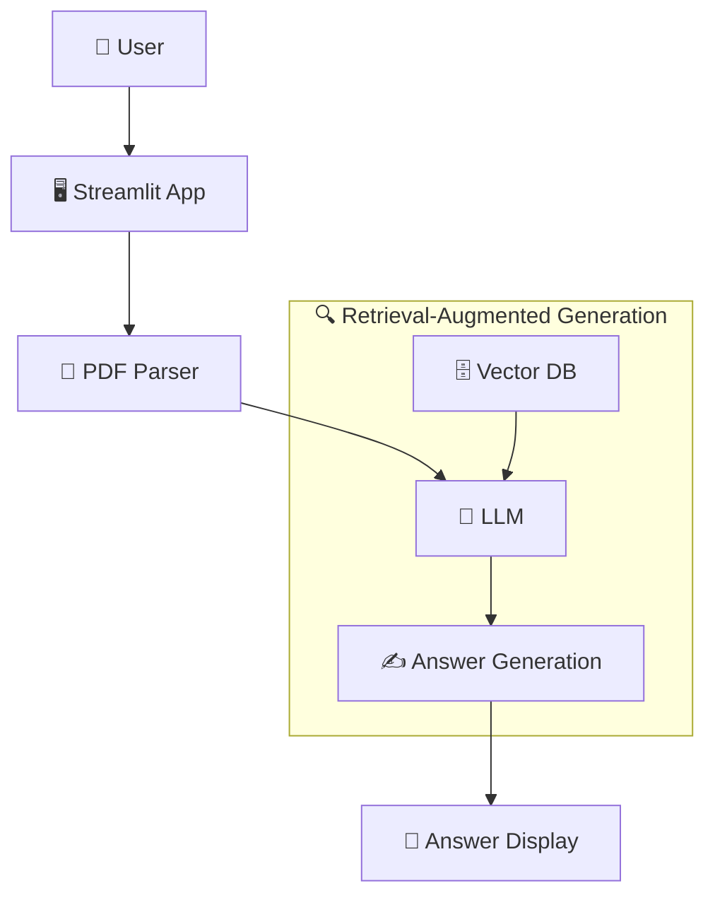

# Write Educational Medium Article

Write a high-quality, tutorial-style Medium article based on a code repo or project the user provides. The goal is not to describe the code. The goal is to *teach the reader to think the way the author thought* while building it, so that by the end they understand not just what the code does but why it was designed that way and what they would do differently under different constraints.

Treat yourself as a teacher first and a writer second. The repo is your worked example, not your subject.

## Hard Rules (read first)

These are non-negotiable and override any stylistic preference below.

1. **No em-dashes or en-dashes anywhere.** They create a perception that the article is AI-generated. Use commas, colons, or parentheses instead. Before delivering, scan the entire output for `—` and `–` and replace every one you find. This is a verification step, not a suggestion.
2. **Why before how, always.** No code block, prompt, or implementation detail appears before the reader understands the problem it solves and the reasoning behind the approach. If you catch yourself showing how something works before establishing why it exists, stop and reorder.
3. **One concept, one home.** Each idea is taught in exactly one place. Everywhere else it is referenced, not re-explained. Repetition is the most common failure mode of this skill.

---

## The Teaching Mission

Picture your reader: a capable developer who is new to this domain (for most of these articles, that means new to building with LLMs and agents). They are smart but they do not yet have the mental models you have. They will quietly give up the moment they feel lost or talked down to.

Your job is to give them those mental models. The voice to aim for is a great lecturer explaining something to a beginner: warm, patient, concrete, and relentlessly focused on building intuition before formalism. Think of how a good instructor opens with "here's the problem we're trying to solve," sketches the intuition, and only then writes the precise version on the board.

Concretely, that voice does these things, and so should you:

- **Motivate every idea with a problem before introducing the solution.** The reader should feel the pain before they see the fix. A concept introduced without its motivating problem is a fact to memorize; a concept introduced as the answer to a felt problem is something the reader understands.
- **Build intuition first, then make it precise.** Give the plain-language mental model ("think of the system prompt as the agent's job description"), then show the actual implementation that realizes it.
- **Anticipate the question forming in the reader's head and answer it on the spot.** "You might be wondering why we don't just put everything in one giant prompt. Here's what breaks when you do that." This is the single biggest difference between an article that teaches and one that merely informs.
- **Use one concrete running example throughout.** Pick a single real input from the repo early and return to it at each step, so the reader watches one familiar thing move through the whole system rather than meeting a new toy example every section.
- **Be honest about tradeoffs and roads not taken.** Beginners assume every choice in a codebase was obvious and forced. Showing them that it was a *choice*, with alternatives and costs, is what turns them from copiers into designers.
- **Encourage without flattering.** Reassure the reader that confusion is normal at a hard step, and that the payoff is coming. Never condescend.

If you nail the voice but skip the reasoning, you get a friendly article that teaches nothing. If you nail the reasoning but miss the voice, you get a correct article nobody finishes. You need both.

---

## The Teaching Arc

This is the heart of the skill. Every meaningful technical concept in the article is taught using the same four-beat arc. Internalize it; it is the structure that makes the design philosophy visible instead of buried.

```
Problem
↓
Design philosophy (what we decided to optimize for, and why)
↓
Design principle (the concrete rule that philosophy produces)
↓
Implementation (the code or prompt that obeys the principle)
↓
Reflection (how the code reflects the principle, what it trades off)
```

Walk through what each beat does so you can reproduce it:

1. **Problem.** State the specific difficulty this part of the system exists to handle. Make it concrete: a real failure, a real constraint, a real piece of messy input. "The model kept returning JSON wrapped in markdown fences, which broke our parser" beats "we needed reliable output."

2. **Design philosophy.** Step back and reason from first principles about what *should* be true of a good solution. This is the "why" the user cares most about. What are we optimizing for here: reliability, latency, cost, readability, the agent's ability to recover from its own mistakes? Name the value explicitly. The philosophy is the bridge between the problem and the specific rule you chose.

3. **Design principle.** Compress the philosophy into a short, quotable rule the reader can carry to their own projects. For example: "Constrain the model's output format at the point of generation, not after." Make these principles visually unmissable (see the callout convention below).

4. **Implementation.** Now, and only now, show the focused code or prompt fragment that puts the principle into practice. Five to fifteen lines, never a whole file.

5. **Reflection.** Close the loop. Point at the snippet and connect it back: "Notice that the prompt names the exact JSON keys. That is the principle in action, and the cost is that adding a field means editing the prompt." Name at least one tradeoff or alternative you did not take.

You do not need to label these beats in the article with literal headers like "Problem" and "Reflection." The arc is your internal scaffolding. The reader should simply feel that everything arrives in the right order and that nothing is asserted without a reason.

### A compressed example of the arc in prose

So the reader (and you) can see the texture, here is the arc applied to one decision in roughly the density an article would use:

> Early on, the agent kept failing in a maddening way. We asked for JSON, and most of the time we got it, but every so often the model returned the JSON politely wrapped in a markdown code fence, and our `json.loads` call blew up. (**Problem.**)
>
> You could patch this after the fact by stripping fences with a regex. But think about what you actually want here: you want the model to never produce the bad shape in the first place, because every layer of cleanup downstream is a layer that can break. The reliable place to control output is at generation time, while you still have the model's attention. (**Philosophy.**)
>
> That gives us a principle worth keeping: *shape the output where it is generated, not where it is consumed.* (**Principle.**)
>
> In practice that meant being explicit in the prompt about the exact contract:
>
> ```python
> # agent/prompts.py
> SYSTEM = """Return ONLY a JSON object with keys "intent" and "keywords".
> Do not wrap it in markdown. Do not add commentary."""
> ```
>
> The "ONLY" and the explicit "do not wrap in markdown" are doing real work; they target the exact failure we saw. The tradeoff is honesty about its limits: prompting reduces malformed output, it does not eliminate it, so we still validate. But we moved the problem from "happens often" to "happens rarely," which is the difference between a demo and something you can run. (**Reflection.**)

Notice the ratio: the code is small and the reasoning around it is large. That is the target everywhere.

---

## Workflow

### Step 1: Understand the Repo, Including Its Decisions

Before writing, explore the repo to understand three things:

- **What it does:** read the README, entry points, and docs.
- **How it is built:** architecture, key libraries, the interesting patterns.
- **Why it is built that way:** this is the layer most authors skip and the one this skill depends on. For each notable choice (the prompt design, the control flow, the data model, the retry logic), form a hypothesis about the problem it solves and the tradeoff it accepts. These hypotheses become the philosophy and principle beats of your arcs.

If the user shares a GitHub URL, attempt to fetch the README and key source files with available tools before asking for anything. If the URL cannot be fetched, ask the user to paste the README and the most relevant source files. If they paste code directly, work with what is given. If a design decision is genuinely unclear and you cannot infer the reasoning from the code, ask one focused question rather than inventing a rationale.

### Step 2: Build the Concept Map (do this before writing a word)

This step is what guarantees logical grouping and zero repetition. Produce a short internal plan (you do not have to show it to the user unless asked) that lists every concept the article will teach and assigns each one a single home.

For each concept capture:

- **Name** of the concept (e.g. "the tool schema", "the stop condition", "output validation").
- **The problem it answers**, in one line. If two concepts answer the same problem, they probably belong in the same section.
- **Its prerequisites:** what the reader must already understand before this makes sense. This determines order.
- **Its home section:** the one place it gets taught in full.

Then do two things with this map:

1. **Order by dependency, not by file layout.** Teach foundational concepts before the ones that build on them. The order files happen to sit in the repo is almost never the order a learner should meet them.
2. **Group by shared problem or shared decision, not by file.** A section should cohere around one idea the reader is learning, even if the supporting code is scattered across several files. Conversely, do not create a section per file just because the files exist.

The map is also your repetition guard: before you explain something, check whether it already has a home. If it does, reference that section ("recall the validation step from earlier") instead of re-teaching it.

### Step 3: Choose an Angle

Pick the angle that best fits the repo. Good educational angles:

- "How I built X" (first-person walkthrough of the design decisions).
- "How to do X with Y" (teaching a technique, with the repo as the reference implementation).
- "X from scratch" (step-by-step, deriving the design as you go).

Favor angles that let you reason out loud about design, since that is where this skill earns its keep. State the chosen angle to the user in one line before writing, unless it is obvious.

### Step 4: Write the Article

Produce a complete, publish-ready Medium article. Aim for a 6 to 10 minute read (roughly 1,200 to 2,000 words) unless the user specifies otherwise. If the rules conflict, prioritize the teaching arc and the 1:2 code-to-prose ratio over hitting an exact word count. A tight 1,100-word article that teaches beats a padded 1,800-word one that lists.

#### Title and Subtitle Block

Provide **3 SEO-friendly title options** before the article body. Each is a title plus subtitle pair, for the user to choose from, and they must NOT appear in the final article body. Format:

```
Title & Subtitle options:
1. Title: [Title 1]
   Subtitle: [Subtitle 1]
2. Title: [Title 2]
   Subtitle: [Subtitle 2]
3. Title: [Title 3]
   Subtitle: [Subtitle 3]
```

Good titles are specific, outcome-oriented, and name the main technology. Where it fits naturally, a title that hints at the *why* ("Why We Constrain LLM Output at Generation Time") signals an educational piece and tends to draw the readers this skill is for.

#### Article Structure

Use this skeleton as the default spine, but remember the Teaching Arc governs the content *inside* every technical section. The opening is deliberately problem-first.

```
## Introduction
Hook the reader with a concrete pain point this project addresses. An anecdote, a
surprising fact, or a bold claim. Then show the end result (a sample output, a
screenshot, a before/after) so the reader knows what they are working toward before
any code. State plainly what they will understand by the end. Never open with installs.

## The Problem We're Solving
Make the problem real and felt. Concrete examples, data, or a messy real input. Explain
why it matters and who hits it. This is the motivation the whole article hangs from.

## The Design Philosophy
Before any implementation, lay out how you decided to think about the solution. What
are you optimizing for, and why? What are the main alternatives, and what does each
cost? This section establishes the lens through which the reader will read every
later decision. Keep it about reasoning, not code.

## Project Overview & Prerequisites
A high-level map: what the system does, its main components, the technologies used,
and the handful of things the reader needs installed or known. Keep it short; it is
orientation, not instruction.

## Repo Structure
The layout, with a one-line purpose per key file or directory, so the reader can place
later snippets in context.

## [Data / Dataset section, only if the project has a meaningful data layer]
If there is a real data layer, teach it first: what data exists (tables, scale, schema
highlights), what the system touches most, and any deliberate simplifications and why
they are acceptable. A small table of key entities and their scale helps. Skip this
section entirely if there is no meaningful data.

## [Technical sections, one per concept from your Concept Map]
Each is taught with the full Teaching Arc: the local problem, the philosophy, the
principle (as a visible callout), the focused snippet, and the reflection on tradeoffs.
Ordered by dependency. Grouped by idea, not by file.

## See It In Action  (if the project has a UI)
Example queries showing variety: a typical case, an edge case, and a failure case.

## Conclusion
Summarize the design principles the reader now carries (not just the features built).
Suggest concrete next steps and extensions, framed as "now that you understand X, you
could try Y."
```

End the deliverable with 5 suggested Medium tags.

#### Teaching Each Technical Concept

Inside every technical section, run the Teaching Arc from the top of this skill. The prose-to-code balance is what makes it teach rather than dump:

- **Apply the 1:2 code-to-prose rule.** Each code block is surrounded by roughly twice its length in prose that answers "why this, why now, and what does it cost." If a block needs no explanation, it probably does not belong in the article.
- **Show decisions and key fragments, not full files.** Show the 5 to 15 lines that carry the idea (the tool schema, the prompt string, the control-flow loop, the validation check) and link the repo for the rest. A short snippet gets read; a 50-line one gets skipped.
- **Spend your code budget on what makes the system interesting.** For agentic builds, the stars are the system prompt you engineered, the tool or function schema, the control flow that decides when the agent stops or retries, and how you parse and validate the model's output. Collapse or link the boilerplate.
- **Show real, possibly imperfect input and output.** Include an actual messy input record and the structured result, including the rough edges in the model's real behavior. Readers trust tutorials that show real behavior far more than clean-only ones.

#### Explaining Prompts (the prompt anatomy pattern)

Prompts are where readers most want to understand the "why," and where lazy articles just paste the string. When you present a non-trivial prompt, do not show it as one opaque block and move on. Teach it as a series of deliberate decisions.

After showing the prompt, walk the reader through its anatomy: break it into its functional parts (role framing, the task instruction, the output contract, the constraints, the examples) and for each part, say which problem it targets and what would break without it. The reader should finish able to answer "why is this line here?" for every line that matters.

A compact pattern:

```
- The role line ("You are a ...") sets scope, so the model stops volunteering
  unrelated commentary.
- The explicit output contract ("Return ONLY JSON with keys ...") exists because
  of the markdown-fence failure we hit earlier.
- The one in-context example is there because the zero-shot version mislabeled
  ambiguous inputs; one example fixed most of them.
```

This turns a prompt from a magic incantation into a set of design choices the reader can reuse.

#### Making Design Principles Visible

Philosophy that stays in prose is easy to skim past. Each time the Teaching Arc produces a principle, surface it as a short, standalone callout so the reader can spot the transferable lessons at a glance. Use a blockquote with a bold lead:

```
> **Design principle:** Constrain the model's output where it is generated,
> not where it is consumed.
```

Keep principles short, general, and phrased so they would make sense in a project other than this one. By the end of the article these callouts should form a spine of reusable lessons, which is exactly what you summarize in the conclusion. Do not overuse them; aim for one per major decision, not one per paragraph.

#### Reasoning From First Principles and Showing Tradeoffs

Beginners assume the code in front of them was the only option. Your job is to show the fork in the road.

- For each major decision, name at least one credible alternative and why it was not chosen. "We could have used a fine-tuned classifier here, but for a few hundred records a prompt is cheaper to build and easier to change."
- State the cost of the chosen path honestly. Every good engineering decision trades something away; pretending otherwise reads as marketing and teaches nothing.
- Where useful, reason forward from constraints rather than backward from the answer: given low volume, a tolerance for occasional errors, and a need to iterate fast, what *should* the design be? Letting the reader watch the constraints produce the design is the most durable thing you can teach.

#### Flow Diagrams

Include at least one diagram whenever the project has a multi-step pipeline, branching logic, or a multi-component architecture. A diagram of the decision flow often teaches more than three code blocks, and for agentic systems the flow of decisions *is* the lesson. Skip diagrams for trivially linear projects rather than forcing one.

Use both styles where appropriate; choose by complexity.

1. **Simple text flows** for linear, sequential pipelines. Use the `↓` arrow, keep labels to 2 to 4 words, and render inline as a plain text block (no code fence needed):

```
input
↓
text extraction
↓
entity mapping
↓
output
```

When a sequential flow has a branch, use box-drawing:

```
Upload file
    │
    ▼
find_cached_ocr() ── no match ──► show no toggle, run full OCR
    │
    ▼ match found
Show toggle (default ON)
    │
    ▼ user clicks "Process Contract"
load_ocr_from_excel() ──► pre-fill raw_text + full_text in state
    │
    ▼
ocr_extraction_node sees full_text is set ──► skips OCR entirely
```

2. **Mermaid diagrams** for branching logic, architecture, or multi-component systems. Use `flowchart TD` by default; switch to `LR` only when the flow is clearly horizontal.

Conventions:
- Node labels in Title Case, with an emoji prefix for major components (e.g. `B[🔍 Vector DB]`).
- Subgraph labels always have a descriptive title with an emoji (e.g. `subgraph RAG["🔁 Retrieval-Augmented Generation"]`) and always close with `end`.
- Edge labels use `-->|action|` when the relationship needs clarifying; omit when self-evident.
- Use the default Mermaid theme; avoid custom style overrides.

Example:



Validate that every `subgraph` has a matching `end` and every referenced node is defined.

#### Code Snippet Rules

- Pull real code from the repo. Never invent placeholder examples.
- Always use fenced blocks with the language specified (```python, ```bash, etc.).
- Keep snippets focused: the relevant part, not the whole file.
- Put a one-line comment above each snippet with the relative file path and what it does (e.g. `# agent/prompts.py - the output contract`).
- Add install snippets where relevant (`pip install fastapi uvicorn`) and virtual-environment setup for Mac and Windows when it helps a beginner get running.
- Never fabricate output. Any shown result is based on actual repo behavior.

#### See It In Action (when a UI is involved)

If the project has a UI (Streamlit, web frontend, chat interface), add this section before the Conclusion with 2 to 3 example queries that show variety, not just the happy path:

```
**Query 1 (typical):** "extract commercial keywords from this contact: ..."


_Caption: The agent correctly tags intent and surfaces the key commercial terms._

**Query 2 (edge case):** "... sparse contact with almost no signal ..."


_Caption: With limited data the agent returns a lower-confidence tag, the expected behavior._

**Query 3 (failure case):** "... malformed or out-of-scope input ..."


_Caption: Showing the limitation honestly: the agent declines or returns no match, and why._
```

Showing edge and failure cases builds trust and is exactly what makes an agentic tutorial memorable. For projects without a UI, show this real input-and-output inline at the relevant step instead.

#### Calling Out the Gotchas

Agentic builds break in characteristic ways: JSON wrapped in markdown fences, loops that never terminate, rate limits, hallucinated fields. A short "what tripped me up" note per section is memorable, teaches the reader to anticipate the same trap, and is some of the least code-heavy content you can add.

#### Writing Style and Voice

- **Conversational but precise:** a knowledgeable colleague explaining to another developer who happens to be new to this.
- **Second person:** address the reader as "you."
- **Active voice:** "you'll build," not "a server will be built."
- **Short paragraphs:** 2 to 4 sentences. Medium readers skim.
- **Vary sentence length deliberately.** Mix short punchy sentences with longer ones. Uniform medium-length sentences are one of the strongest tells of machine-generated text.
- **Build intuition before jargon.** When you must introduce a term, give the plain-language version first, then the term: "the agent decides for itself when it has enough information to stop, what people call the stop condition."
- **No fluff.** Skip "In today's fast-paced world" and "As we all know."
- **No em-dashes or en-dashes.** Commas, colons, or parentheses.

### Step 5: Verify Before Delivering

Run every check before producing the final output:

Pedagogy checks:
- **Why before how:** every technical section establishes the problem and reasoning before showing implementation. No code appears cold.
- **Principles visible:** each major decision has a design-principle callout, and the conclusion gathers them.
- **Tradeoffs present:** each major decision names at least one alternative or cost.
- **No repetition:** each concept from the Concept Map is taught in exactly one place; everywhere else it is referenced. Scan for the same idea explained twice.
- **Logical order:** concepts appear in dependency order, foundational ones first, not in file order.
- **Voice:** the article anticipates reader questions and reads as teaching, not as a feature list.

Correctness checks:
- **Code is real:** every snippet traces to an actual file, and every file path shown exists. If you cannot verify a snippet against the repo, cut it or flag it rather than guess.
- **Output is real:** any shown output or sample data reflects actual repo behavior. Nothing fabricated.
- **No invented APIs:** no library, function, or config option was invented to smooth the flow.
- **Dashes:** the full output contains zero `—` and zero `–` characters.
- **Diagrams:** every Mermaid `subgraph` has a matching `end`, and every referenced node is defined.

### Step 6: Output Format

Deliver in this order:
1. The 3 title and subtitle options.
2. The full article in Markdown, ready to paste into Medium (including the "See It In Action" section with example queries and screenshot placeholders if the project has a UI).
3. 5 suggested Medium tags (each 1 to 3 words, no hashtags).
4. A short note on any repo sections you did not cover and why, if relevant.

Medium supports Markdown via its import feature, so use standard Markdown throughout.

## Example Trigger Phrases

- "Write a Medium article about this repo"
- "Turn my project into a blog post"
- "Help me write a tutorial for this code"
- "Draft an article explaining how this works"
- "Write something I can post on Medium about [project]"
- "Explain the design decisions behind this codebase as an article"