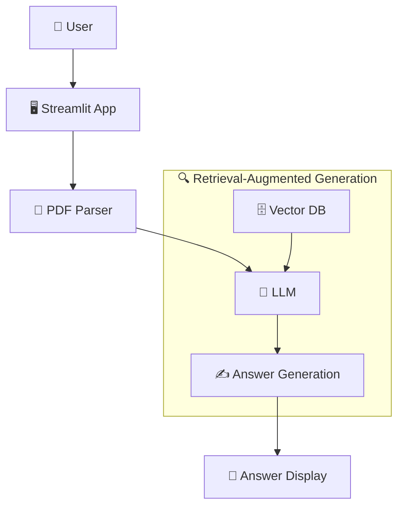

# Write Medium Article

Write a high-quality, tutorial-style Medium article based on a code repo or project the user provides.

Very important: Do not use em-dashes or en-dashes anywhere, as that creates a perception that the article is AI-generated. Use natural sentence structures, commas, colons, and parentheses instead. Before delivering, scan the entire output for `—` and `–` and replace any you find. This is a hard requirement, not a stylistic preference.

## Workflow

### 1. Understand the Repo

Before writing, explore the repo to understand:
- **What it does**: read the README, entry points, and any docs
- **Key technical decisions**: architecture, libraries, interesting patterns
- **The "why"**: what problem does it solve, why would a reader care?

If the user shares a GitHub URL, attempt to fetch the README and key source files using available tools before asking the user for anything. If the URL cannot be fetched, ask the user to paste the README and the most relevant source files. If they paste code directly, work with what's given. If something is unclear, ask one focused question before proceeding.

### 2. Choose an Angle

Pick the angle that best suits the repo. For tutorial/how-to articles, good angles include:
- "How I built X": first-person walkthrough of building the project
- "How to do X with Y": teaching a technique using the repo as the example
- "X from scratch": step-by-step guide using the code as the reference implementation

State the chosen angle briefly to the user before writing, unless it's obvious.

### 3. Write the Article

Produce a complete, publish-ready Medium article. Aim for a 6 to 10 minute read (roughly 1,200 to 2,000 words) unless the user specifies otherwise.

If the writing rules ever conflict, prioritize snippet focus and the 1:2 code-to-prose ratio (described below) over hitting an exact word count. A tight 1,100-word article beats a padded 1,800-word one.

#### Title & Subtitle Block

Provide **3 SEO-friendly title options** before the article body. Each option is a title plus a subtitle pair. These are for the user to choose from and must NOT appear in the final article body. Format:

```
Title & Subtitle options:
1. Title: [Title 1]
   Subtitle: [Subtitle 1]
2. Title: [Title 2]
   Subtitle: [Subtitle 2]
3. Title: [Title 3]
   Subtitle: [Subtitle 3]
```

Good titles are specific, outcome-oriented, and include the main technology (e.g. "Build a REST API with FastAPI and PostgreSQL in 15 Minutes").

#### Article Structure

This is the default skeleton. Note that the agentic-tutorial rules below override it where they conflict: in particular, lead with the problem and a visible end result before any setup, even though the skeleton lists Prerequisites early.

```
## Introduction
Give a very catchy introduction that hooks the reader. Start with a concrete problem or pain point that the project addresses. Use an anecdote, a surprising fact, or a bold statement to draw the reader in. Then briefly state what the article will cover and what the reader will learn by the end.

## Problem Statement
Describe the problem in more detail. Use concrete examples, data, or anecdotes to make it real. Explain why it matters and who is affected. This is the "why" that motivates the reader to keep going.

## Project Overview
Give a high-level overview of the project: what it does, the main components, and the technologies it uses. This sets the stage for the tutorial and helps the reader understand the context before diving into the how-to. Where possible, show the end result (a sample output, a screenshot, or a before/after) here or earlier, so the reader knows what they are working toward before they read any code.

## Prerequisites
Brief bullet list: what the reader needs to know / have installed.

## [Section 1: First major concept or step]
...

## [Section 2: Next step]
...

## [Continue as needed]

## Conclusion
Summarize what was built/learned. Suggest next steps or extensions.
```

End the deliverable with 5 suggested Medium tags for the article.

#### Code Snippets
- Pull real code from the repo. Do not invent placeholder examples.
- Always wrap in fenced code blocks with the language specified (```python, ```bash, etc.)
- Keep snippets focused: show only the relevant part, not entire files
- Add a one-line comment above each snippet explaining what it does
- Add the relative file path in the comment as it helps orient the reader (e.g. `# app.py`)
- Add requirements installation snippets if relevant (e.g. `pip install fastapi uvicorn`)
- Include virtual environment setup for Mac and Windows if relevant (e.g. `python -m venv venv` plus activation commands)
- Never fabricate output or results. If you show what the code produces, base it on actual repo behavior.

#### Demo & Example Queries (when a UI is involved)

If the project has a UI (e.g. a Streamlit app, web frontend, or chat interface), add a "Try it out" or "See it in action" section near the end, before the Conclusion. Include 2 to 3 example input queries that show variety, not just the happy path:

- A typical, representative query (the main use case working well)
- An edge case or tricky input (ambiguous, sparse, or unusual data)
- A failure or limitation case (where the agent struggles, returns nothing, or hits a known boundary)

For each query, state the input, briefly describe what to expect, and include a screenshot placeholder so the user knows where to drop the image. Use this format:

```
**Query 1 (typical):** "extract commercial keywords from this contact: ..."


_Caption: The agent correctly tags intent and surfaces the key commercial terms._

**Query 2 (edge case):** "... sparse contact with almost no signal ..."


_Caption: With limited data the agent returns a lower-confidence tag, which is the expected behavior._

**Query 3 (failure case):** "... malformed or out-of-scope input ..."


_Caption: Showing the limitation honestly: here the agent declines / returns no match, and why._
```

Showing edge and failure cases (not only successes) builds trust and is exactly the kind of content that makes an agentic tutorial memorable.

#### Flow Diagrams

Include at least one diagram whenever the project has a multi-step pipeline, branching logic, or a multi-component architecture. Skip diagrams entirely for trivially linear projects rather than forcing one in.

Use both styles where appropriate in the same article. Choose based on complexity:

1. Simple text flows: for linear, step-by-step pipelines. Use whenever a process is sequential. Use the `↓` arrow and keep labels short (2 to 4 words). No code block needed, render inline as a plain text block.

Example:
```
input
↓
text extraction
↓
entity mapping
↓
output
```

When a sequential flow has a branch, use the box-drawing style:

```
Upload file
    │
    ▼
find_cached_ocr() ── no match ──► show no toggle, run full OCR
    │
    ▼ match found
Show toggle (default ON)
    │
    ▼ user clicks "Process Contract"
load_ocr_from_excel() ──► pre-fill raw_text_by_page + full_text in state
    │
    ▼
ocr_extraction_node sees full_text is set ──► skips OCR entirely
    │
    ▼
Continues to indexing, field extraction, Excel output
```

2. Mermaid diagrams: for branching logic, architecture, or multi-component systems. Use `flowchart TD` (top-down) by default; switch to `LR` (left-right) only when the flow is clearly horizontal in nature.

Conventions:
- Node labels: Title Case with an emoji prefix for major components (e.g. `B[🔍 Vector DB]`)
- Subgraph labels: always include a descriptive title with an emoji (e.g. `subgraph RAG["🔁 Retrieval-Augmented Generation"]`) and always close with `end`
- Edge labels: use `-->|action|` syntax when the relationship needs clarification, omit when the flow is self-evident
- Theme: use the default Mermaid theme; avoid custom style overrides unless critical

Always validate that every `subgraph` has a matching `end` and every referenced node is defined.

Example Mermaid diagram:


#### Writing Style
- **Conversational but precise**: write like a knowledgeable colleague explaining to another developer
- **Second person**: address the reader as "you"
- **Active voice**: "you'll build", not "a server will be built"
- **Short paragraphs**: 2 to 4 sentences max; Medium readers skim
- **Vary sentence length deliberately**: mix short punchy sentences with longer ones. Uniform medium-length sentences are one of the strongest tells of machine-generated text.
- **No fluff**: skip filler phrases like "In today's fast-paced world..." or "As we all know..."
- **No em-dashes or en-dashes**: use commas, colons, or parentheses instead

#### Writing Agentic Use-Case Tutorials

Most articles here are step-by-step tutorials for agentic use cases (e.g. text-to-skill, contact intelligence that extracts commercial keywords from contacts using AI). These need code to be credible, but a wall of code is what kills them. The popular code-heavy articles win not because of code volume, but because every snippet is small, well-placed, and bracketed by a clear reason and a visible result. Follow these rules:

- **Lead with the problem and the result, not the setup.** Open with the concrete pain and show the end output (a sample table, a screenshot, real tagged data) before any code. Never open with installs or imports. This overrides the default skeleton ordering.

- **Apply the 1:2 code-to-prose rule.** Each code block should be surrounded by roughly twice its length in prose that answers "why this, why now." If a block needs no explanation, it probably does not belong in the article. Pattern per step: goal heading, short why, the focused snippet, then the result you now have working.

- **Show decisions and key fragments, not full files.** Do not paste entire source files. Show the 5 to 15 lines that matter (the tool schema, the prompt string, the control-flow loop) and link the full repo for the rest. A 5 to 15 line snippet gets read; a 50 line one gets skipped.

- **Spend the code budget on what makes agents interesting.** For agentic builds, the stars are: the system prompt you engineered, the tool/function schema, the control flow that decides when the agent stops or retries, and how you parse and validate the model's output. Collapse or link boilerplate (framework setup, imports, env vars).

- **Narrate the agent's flow of decisions.** A diagram of the decision flow (input → LLM extracts → validate → retry if malformed → write result) often does more than three code blocks. Prefer one good Mermaid diagram over repeated boilerplate code. This is what separates an agentic tutorial from a generic one.

- **Show real, possibly imperfect input and output.** Include an actual messy input record going in and the structured result coming out, including any rough edges in the model's real behavior. Readers trust tutorials that show real behavior far more than clean-code-only ones. (The "Demo & Example Queries" section above is where this lives when the project has a UI; for non-UI projects, show it inline at the relevant step.)

- **Call out the gotchas.** Agentic builds break in characteristic ways: JSON wrapped in markdown fences, loops that never terminate, rate limits, hallucinated fields. A short "what tripped me up" note per section is memorable content that is not code.

### 3.5 Verify Before Delivering

Before producing the final output, run these checks:
- **Code is real**: every snippet is traceable to an actual file in the repo, and every file path shown actually exists. If you cannot verify a snippet against the repo, cut it or flag it explicitly to the user rather than guessing.
- **Output is real**: any shown output, results, or sample data reflects actual repo behavior. Nothing is fabricated.
- **No invented APIs**: no library, function, or config option was invented to make the tutorial flow more smoothly.
- **Dashes**: the full output contains zero `—` and zero `–` characters.
- **Diagrams**: every Mermaid `subgraph` has a matching `end`, and every referenced node is defined.

### 4. Output Format

Deliver in this order:
1. Title options (3 choices)
2. The full article in Markdown, ready to paste into Medium (including a "Try it out" section with 2 to 3 example queries and screenshot placeholders if the project has a UI)
3. 5 suggested Medium tags (each 1 to 3 words, Medium-style, no hashtags)
4. A short note on any repo sections you didn't cover and why (if relevant)

Medium supports Markdown via its import feature, so use standard Markdown throughout.

## Example Trigger Phrases

- "Write a Medium article about this repo"
- "Turn my project into a blog post"
- "Help me write a tutorial for this code"
- "Draft an article explaining how this works"
- "Write something I can post on Medium about [project]"
