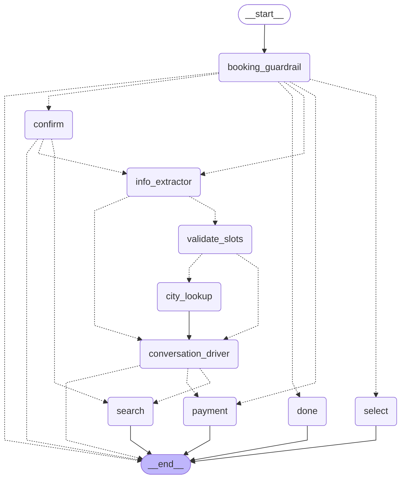

# Booking Subgraph

```mermaid
---
config:
  flowchart:
    curve: linear
---
graph TD;
	__start__([<p>__start__</p>]):::first
	booking_guardrail(booking_guardrail)
	info_extractor(info_extractor)
	validate_slots(validate_slots)
	city_lookup(city_lookup)
	conversation_driver(conversation_driver)
	confirm(confirm)
	search(search)
	select(select)
	payment(payment)
	done(done)
	__end__([<p>__end__</p>]):::last
	__start__ --> booking_guardrail;
	booking_guardrail -.-> __end__;
	booking_guardrail -.-> confirm;
	booking_guardrail -.-> done;
	booking_guardrail -.-> info_extractor;
	booking_guardrail -.-> payment;
	booking_guardrail -.-> select;
	city_lookup --> conversation_driver;
	confirm -.-> __end__;
	confirm -.-> info_extractor;
	confirm -.-> search;
	conversation_driver -.-> __end__;
	conversation_driver -.-> payment;
	conversation_driver -.-> search;
	info_extractor -.-> conversation_driver;
	info_extractor -.-> validate_slots;
	validate_slots -.-> city_lookup;
	validate_slots -.-> conversation_driver;
	done --> __end__;
	payment --> __end__;
	search --> __end__;
	select --> __end__;
	classDef default fill:#f2f0ff,line-height:1.2
	classDef first fill-opacity:0
	classDef last fill:#bfb6fc

```
