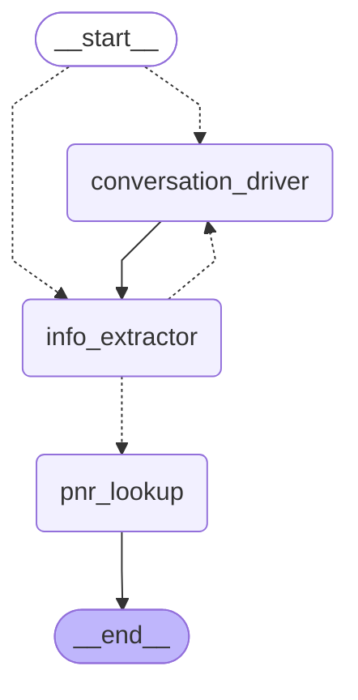

# Pnr Subgraph

```mermaid
---
config:
  flowchart:
    curve: linear
---
graph TD;
	__start__([<p>__start__</p>]):::first
	conversation_driver(conversation_driver)
	info_extractor(info_extractor)
	pnr_lookup(pnr_lookup)
	__end__([<p>__end__</p>]):::last
	__start__ -.-> conversation_driver;
	__start__ -.-> info_extractor;
	conversation_driver --> info_extractor;
	info_extractor -.-> conversation_driver;
	info_extractor -.-> pnr_lookup;
	pnr_lookup --> __end__;
	classDef default fill:#f2f0ff,line-height:1.2
	classDef first fill-opacity:0
	classDef last fill:#bfb6fc

```
