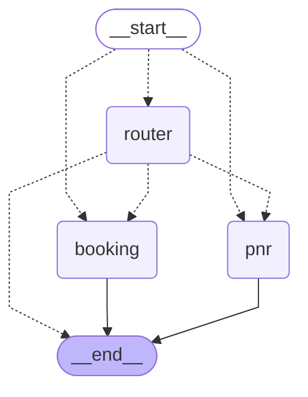

# Top Level

```mermaid
---
config:
  flowchart:
    curve: linear
---
graph TD;
	__start__([<p>__start__</p>]):::first
	router(router)
	booking(booking)
	pnr(pnr)
	__end__([<p>__end__</p>]):::last
	__start__ -.-> booking;
	__start__ -.-> pnr;
	__start__ -.-> router;
	router -.-> __end__;
	router -.-> booking;
	router -.-> pnr;
	booking --> __end__;
	pnr --> __end__;
	classDef default fill:#f2f0ff,line-height:1.2
	classDef first fill-opacity:0
	classDef last fill:#bfb6fc

```
