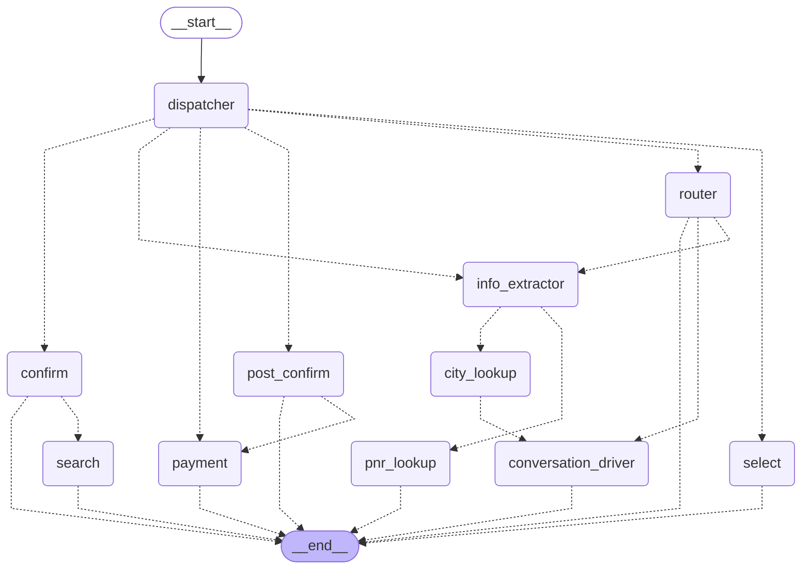

# Flight Booking Assistant Graph

```mermaid
---
config:
  flowchart:
    curve: linear
---
graph TD;
	__start__([<p>__start__</p>]):::first
	dispatcher(dispatcher)
	router(router)
	info_extractor(info_extractor)
	city_lookup(city_lookup)
	conversation_driver(conversation_driver)
	confirm(confirm)
	search(search)
	select(select)
	post_confirm(post_confirm)
	payment(payment)
	pnr_lookup(pnr_lookup)
	__end__([<p>__end__</p>]):::last
	__start__ --> dispatcher;
	city_lookup -.-> conversation_driver;
	confirm -.-> __end__;
	confirm -.-> search;
	conversation_driver -.-> __end__;
	dispatcher -.-> confirm;
	dispatcher -.-> info_extractor;
	dispatcher -.-> payment;
	dispatcher -.-> post_confirm;
	dispatcher -.-> router;
	dispatcher -.-> select;
	info_extractor -.-> city_lookup;
	info_extractor -.-> pnr_lookup;
	payment -.-> __end__;
	pnr_lookup -.-> __end__;
	post_confirm -.-> __end__;
	post_confirm -.-> payment;
	router -.-> __end__;
	router -.-> conversation_driver;
	router -.-> info_extractor;
	search -.-> __end__;
	select -.-> __end__;
	classDef default fill:#f2f0ff,line-height:1.2
	classDef first fill-opacity:0
	classDef last fill:#bfb6fc

```
