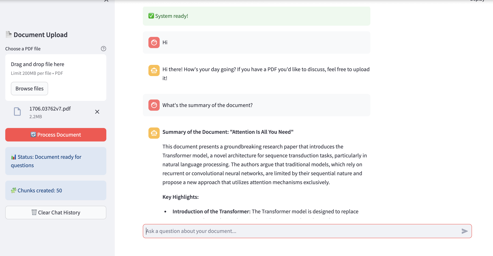
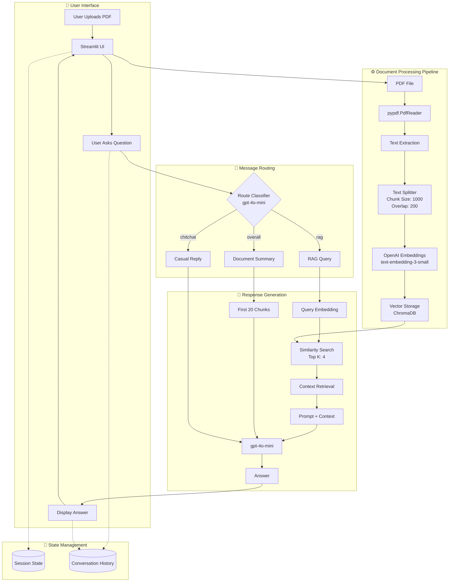

# 📚 RAG Document Chatbot - Streamlit Application

A RAG (Retrieval-Augmented Generation) system that allows users to upload PDF documents and ask questions about their content using OpenAI's GPT models and ChromaDB for vector storage.



## 🌟 Features

- **PDF Document Processing**: Upload and extract text from PDF files using `pypdf`
- **Intelligent Text Chunking**: Splits documents into 1000-character chunks with 200-character overlap
- **Semantic Search**: Uses OpenAI `text-embedding-3-small` embeddings for accurate context retrieval
- **Smart Message Routing**: Automatically classifies queries as `chitchat`, `overall` (summary), or `rag` (document lookup)
- **Document Summarization**: Generates structured summaries from the first 20 chunks of a document
- **Conversational Interface**: Chat-based interaction with conversation history via Streamlit
- **ChromaDB Vector Store**: In-memory vector storage for fast similarity search (top-k: 4)

## 🏗️ System Architecture & Solution Flow



## 🛠️ Tech Stack

| Component | Technology |
|---|---|
| UI Framework | Streamlit |
| LLM & Embeddings | OpenAI (`gpt-4o-mini`, `text-embedding-3-small`) |
| PDF Parsing | `pypdf` |
| Vector Database | ChromaDB (in-memory) |
| Environment Config | `python-dotenv` |

## 📦 Installation

```bash
# Clone the repo and navigate to this folder
cd beginner/simple-rag

# Install dependencies
pip install -r requirements.txt
```

## ⚙️ Configuration

Create a `.env` file in this directory:

```env
OPENAI_API_KEY=your_openai_api_key_here
```

## 🚀 Running the App

```bash
streamlit run app.py
```

## 💬 How to Use

1. Open the app in your browser (default: `http://localhost:8501`)
2. Upload a PDF file using the **sidebar uploader**
3. Click **"🔄 Process Document"** to extract and index the content
4. Type your question in the chat input at the bottom

### Query Types

| Type | Example | Behavior |
|---|---|---|
| Chitchat | "Hi!", "Thanks!" | Friendly reply, reminds you to upload a PDF |
| Summary | "Summarize this", "What is this about?" | Generates a structured summary from first 20 chunks |
| RAG | "What does section 3 say?" | Embeds query, retrieves top-4 chunks, answers from context |

## 📁 Project Structure

```
beginner/simple-rag/
├── app.py              # Main Streamlit application
├── requirements.txt    # Python dependencies
├── .env                # API keys (not committed)
└── README.md
```
